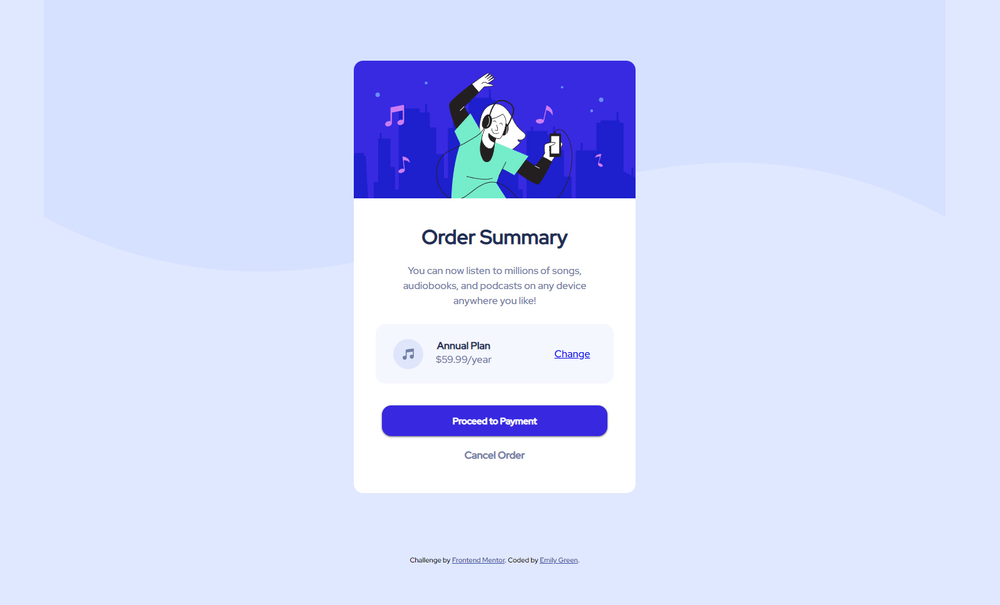

# Frontend Mentor - Order summary card solution

This is a solution to the [Order summary card challenge on Frontend Mentor](https://www.frontendmentor.io/challenges/order-summary-component-QlPmajDUj). Frontend Mentor challenges help you improve your coding skills by building realistic projects. 

## Table of contents

- [Overview](#overview)
  - [The challenge](#the-challenge)
  - [Screenshot](#screenshot)
- [My process](#my-process)
  - [Built with](#built-with)
  - [What I learned](#what-i-learned)
  - [Continued development](#continued-development)
- [Author](#author)

## Overview

### The challenge

Your challenge is to build out this order summary card component and get it looking as close to the design as possible.

Users should be able to:

- See hover states for interactive elements

### Screenshot

## My process

### Built with

- HTML
- CSS

### What I learned

I have started learning to code by doing a web development course and wanted to do some projects to practice the HTML and CSS skills I have aquired so far. The main thing I have learned is how to use the flexbox for layout.

### Continued development

I want to continue doing more projects to practice what I have learned. This being my first project outside of the personal webisites I created following my course it took quite a long time and I am hoping to see if I can complete my next project quicker! I would also like to learn more about the flexbox.

## Author

- GitHub - [Emily Green](https://github.com/emily-green)
- Frontend Mentor - [@emily-green](https://www.frontendmentor.io/profile/emily-green)

